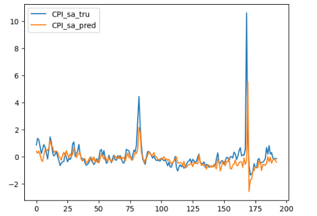

### Description

Custom implementation of BVAR model (Bayesian vector autoregression) using PyMC library. The implemented model was tested on macroeconomic data for forecasting inflation (CPI index) data.

### Model Specificaiton

Several edits were made to improve existing PyMC BVAR implementations:
- You can pass K exogenous variables in the model, but state that only L of them (L<=K) are used for fitting. For example, this allows to model 4 VAR equations with 20 exogenous variables;
- OLS prior estimates were added to improve model convergence speed;
- Added code snippets for forecasting model on test period.

### Model results

### PyMC model graph

